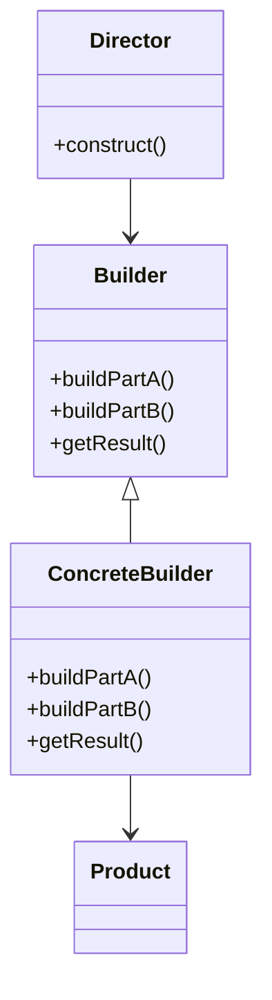

[[Design Patterns and Code refactoring]]

# Builder Design Pattern 📝

## Definition
The Builder pattern is a creational design pattern that lets you construct complex objects step by step. It's especially useful when you need to create an object with numerous possible configurations.

## Problem It Solves
- Constructing complex objects with many optional parameters
- Avoiding "telescoping constructor" anti-pattern
- Creating different representations of the same object

## When to Use
- When object construction involves multiple steps
- When the algorithm for creating a complex object should be independent of the parts and how they're assembled
- When the construction process must allow different representations of the constructed object

## Structure


![[Pasted image 20241104085159.png]]
## Key Components
1. **Builder** (interface)
   - Declares product construction steps

2. **ConcreteBuilder**
   - Implements construction steps
   - Maintains product representation
   - Provides method to retrieve result

3. **Director** (optional)
   - Constructs object using Builder interface
   - Defines order of construction steps

4. **Product**
   - Complex object being built

## Example Implementation (Java)
```java
// Product
class Pizza {
    private String dough;
    private String sauce;
    private String topping;
    // getters...
}

// Builder
interface PizzaBuilder {
    PizzaBuilder buildDough();
    PizzaBuilder buildSauce();
    PizzaBuilder buildTopping();
    Pizza build();
}

// Concrete Builder
class HawaiianPizzaBuilder implements PizzaBuilder {
    private Pizza pizza = new Pizza();

    public PizzaBuilder buildDough() {
        pizza.setDough("cross");
        return this;
    }

    public PizzaBuilder buildSauce() {
        pizza.setSauce("mild");
        return this;
    }

    public PizzaBuilder buildTopping() {
        pizza.setTopping("ham+pineapple");
        return this;
    }

    public Pizza build() {
        return pizza;
    }
}

// Director
class Waiter {
    private PizzaBuilder pizzaBuilder;

    public void setPizzaBuilder(PizzaBuilder pb) {
        pizzaBuilder = pb;
    }

    public Pizza getPizza() {
        return pizzaBuilder.build();
    }

    public void constructPizza() {
        pizzaBuilder.buildDough()
                   .buildSauce()
                   .buildTopping();
    }
}
```

## Pros
- ✅ Construct objects step-by-step
- ✅ Reuse construction code
- ✅ Single Responsibility Principle
- ✅ Encapsulates complex construction
- ✅ Fine control over construction process

## Cons
- ❌ More complex code due to multiple new classes
- ❌ Must create concrete builder for each type of product

## Common Use Cases
1. Building complex documents (PDF, HTML)
2. Constructing objects with many optional parameters
3. Creating composite objects
4. Database query builders
5. GUI builders

## Related Patterns
- Abstract Factory
- Composite
- Fluent Interface (variation)

## Tags
#designpattern #creational #builder #software #java