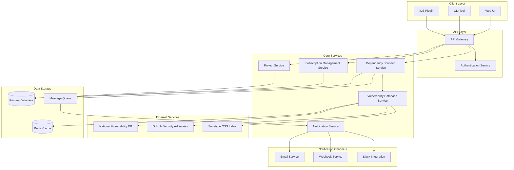

```mermaid
graph TB
    subgraph Client Layer
        WUI[Web UI]
        CLI[CLI Tool]
        IDE[IDE Plugin]
    end

    subgraph API Layer
        API[API Gateway]
        AUTH[Authentication Service]
    end

    subgraph Core Services
        DS[Dependency Scanner Service]
        VDB[Vulnerability Database Service]
        NS[Notification Service]
        SMS[Subscription Management Service]
        PS[Project Service]
    end

    subgraph External Services
        NVD[National Vulnerability DB]
        GHSA[GitHub Security Advisories]
        OSS[Sonatype OSS Index]
    end

    subgraph Data Storage
        DB[(Primary Database)]
        CACHE[(Redis Cache)]
        MQ[Message Queue]
    end

    subgraph Notification Channels
        EMAIL[Email Service]
        WEBHOOK[Webhook Service]
        SLACK[Slack Integration]
    end

    WUI --> API
    CLI --> API
    IDE --> API
    
    API --> AUTH
    API --> DS
    API --> SMS
    API --> PS

    DS --> VDB
    DS --> MQ
    VDB --> NVD
    VDB --> GHSA
    VDB --> OSS
    
    MQ --> NS
    NS --> EMAIL
    NS --> WEBHOOK
    NS --> SLACK
    
    DS --> DB
    VDB --> CACHE
    SMS --> DB
    PS --> DB
```