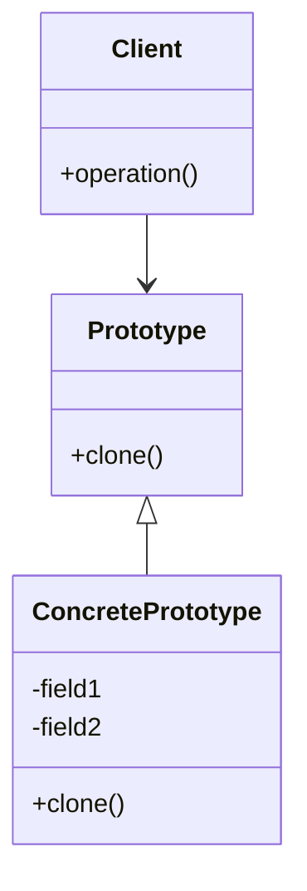

# Prototype Pattern 🔄

## Definition
> Creates new objects by cloning an existing object, known as the prototype, instead of creating objects from scratch.

## UML Diagram


## Use Cases 📋
- Creating objects when instantiation is costly (DB operations, API calls)
- When objects have many shared states
- Creating objects dynamically at runtime
- Examples:
  - Game objects (enemies, items)
  - Document templates
  - UI component libraries

## Pros ✅
- Reduces object creation overhead
- Avoids repeating initialization code
- Creates objects without coupling to their classes
- Helps create complex objects more conveniently

## Cons ❌
- Cloning complex objects with circular references can be tricky
- Deep copy vs shallow copy considerations
- Overriding clone method can be challenging
- Each prototype subclass must implement clone()

## Quick Example (TypeScript)
```typescript
interface Prototype {
    clone(): Prototype;
}

class DocumentPrototype implements Prototype {
    constructor(private title: string, private content: string) {}
    
    clone(): DocumentPrototype {
        return new DocumentPrototype(this.title, this.content);
    }
}

// Usage
const template = new DocumentPrototype("Report", "Standard content");
const doc1 = template.clone();
```

## Related Patterns
- [[Abstract Factory]]
- [[Composite]]
- [[Decorator]]

#design-patterns #creational-patterns #software-engineering