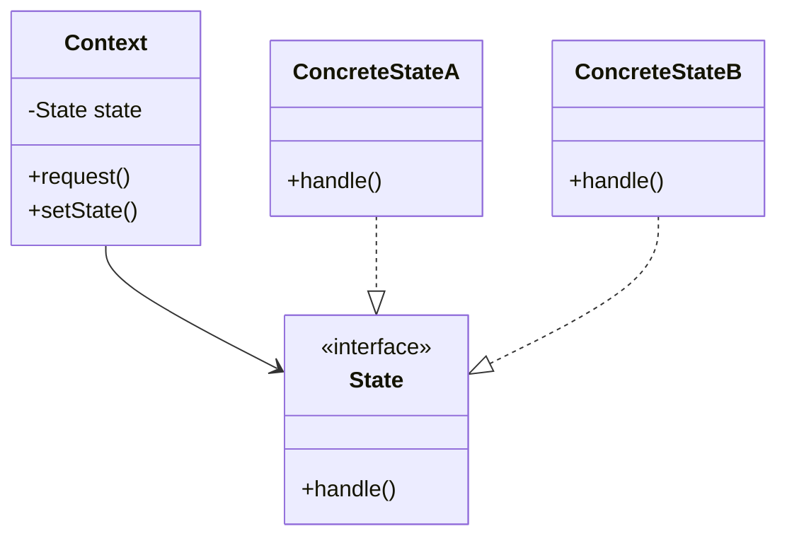

# State Design Pattern 🔄
#design-patterns #behavioral-patterns #oop

## Definition
The State pattern allows an object to alter its behavior when its internal state changes. The object will appear to change its class.

## 🎯 Purpose
- Organize code when an object's behavior depends on its internal state
- Allow objects to completely change their behavior at runtime
- Avoid large conditional statements that depend on the object's state

## 🏗️ Structure
![[state-pattern-structure]]


## 🔑 Key Components
1. **Context**
   - Maintains an instance of a ConcreteState subclass that defines the current state
   - Delegates state-specific behavior to the current State object

2. **State Interface**
   - Defines an interface for encapsulating the behavior associated with a particular state

3. **Concrete States**
   - Each subclass implements behavior associated with a state of the Context

## 📝 Example Implementation
```java
// State interface
interface State {
    void handle(Context context);
}

// Concrete states
class StartState implements State {
    public void handle(Context context) {
        System.out.println("System is in start state");
        context.setState(new RunningState());
    }
}

class RunningState implements State {
    public void handle(Context context) {
        System.out.println("System is running");
        context.setState(new StopState());
    }
}

// Context
class Context {
    private State state;
    
    public Context() {
        state = new StartState();
    }
    
    public void setState(State state) {
        this.state = state;
    }
    
    public void request() {
        state.handle(this);
    }
}
```

## ✅ Advantages
- Single Responsibility Principle: State-specific behavior is isolated in separate classes
- Open/Closed Principle: New states can be added without changing existing state classes
- Eliminates complex if/else or switch statements
- Makes state transitions explicit

## ❌ Disadvantages
- Can be overkill for simple state management
- Increased number of classes
- State transitions can become scattered if not managed carefully

## 🎯 Use Cases
1. **Vending Machine**
   - Different states: NoCoin, HasCoin, Dispensing, OutOfStock
   - Behavior changes based on current state

2. **Document Editor**
   - States: Draft, Moderation, Published
   - Different operations available in each state

3. **Order Processing**
   - States: New, Paid, Shipped, Delivered
   - Different actions available at each stage

## 🔄 Related Patterns
- [[Strategy Pattern]]: Similar structure but different intent. Strategy focuses on interchangeable algorithms, while State focuses on object behavior based on internal state
- [[Singleton]]: State objects are often implemented as singletons

## 🎓 Real-World Analogies
1. **Traffic Light**
   - States: Red, Yellow, Green
   - Each state has specific behavior and rules for transition

2. **Bank Account**
   - States: Normal, Overdrawn, Frozen
   - Available operations change based on account state

## 📚 Code Examples
### TypeScript Example
```typescript
interface State {
    handleRequest(): void;
}

class OrderState implements State {
    handleRequest(): void {
        console.log("Processing order...");
    }
}

class ShippingState implements State {
    handleRequest(): void {
        console.log("Shipping order...");
    }
}
```

## 💡 Tips
1. Consider using State when:
   - Object behavior depends on its state
   - State-specific behavior should be independent
   - State transitions are complex

2. Implementation considerations:
   - Decide who defines state transitions
   - Consider using Singleton for state objects
   - Plan for state persistence if needed

## 🔗 Resources
- Design Patterns: Elements of Reusable Object-Oriented Software
- Head First Design Patterns
- [RefactoringGuru - State Pattern](https://refactoring.guru/design-patterns/state)

###### Tags
#software-engineering #design-patterns #behavioral-patterns #state-pattern #object-oriented-design