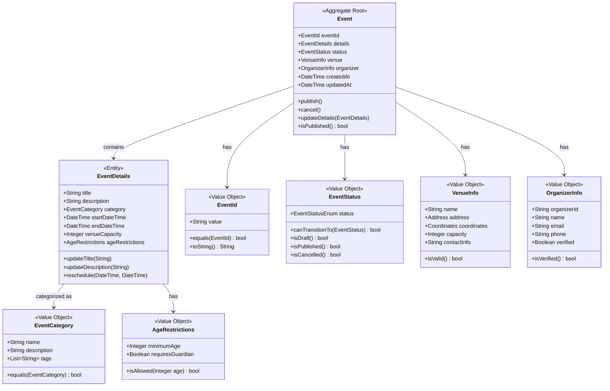
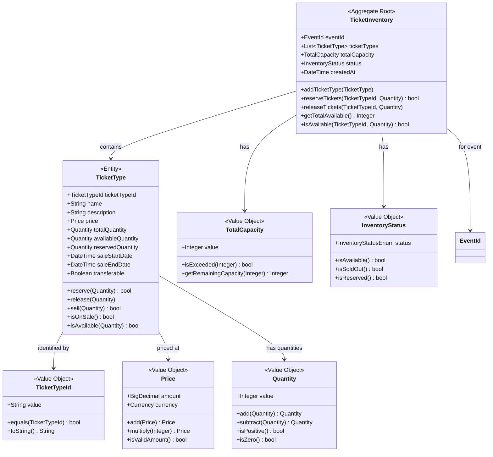
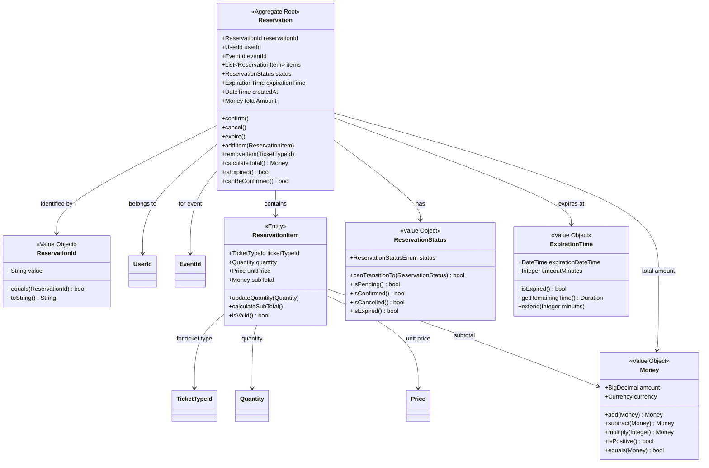
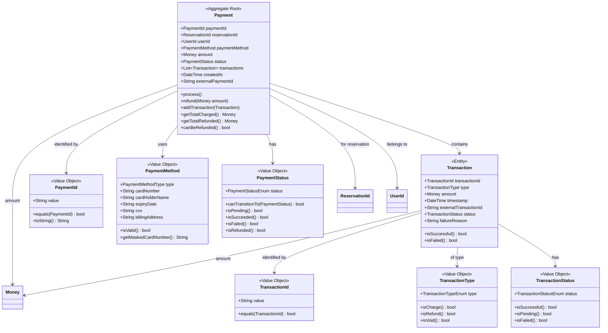
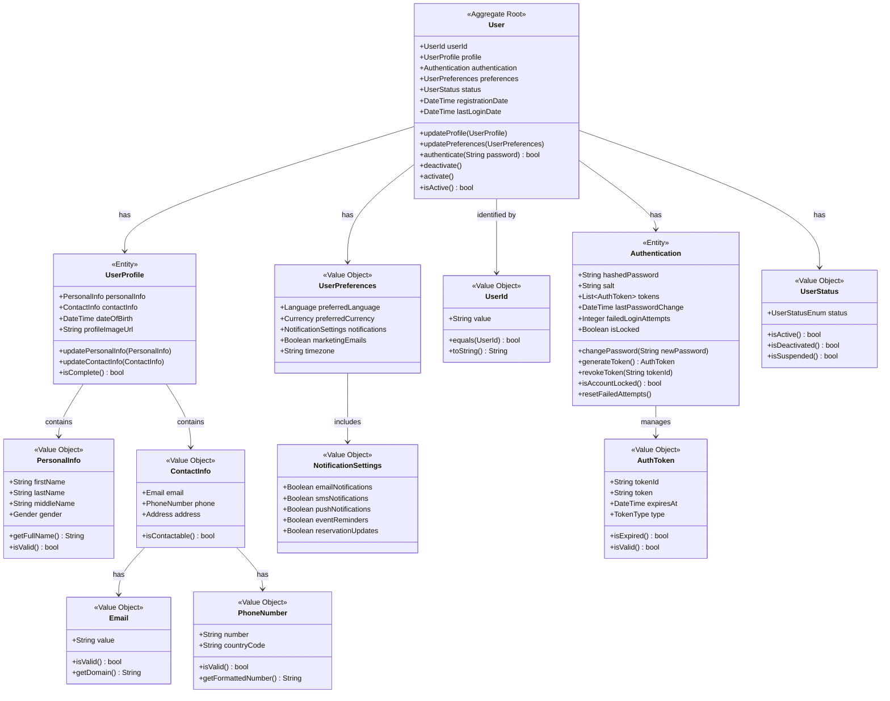
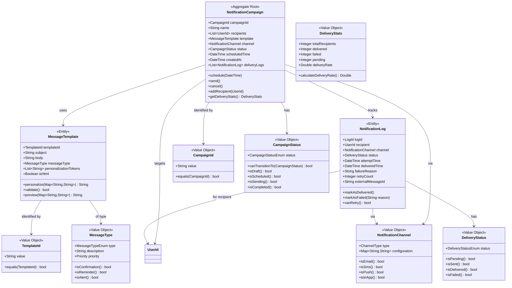
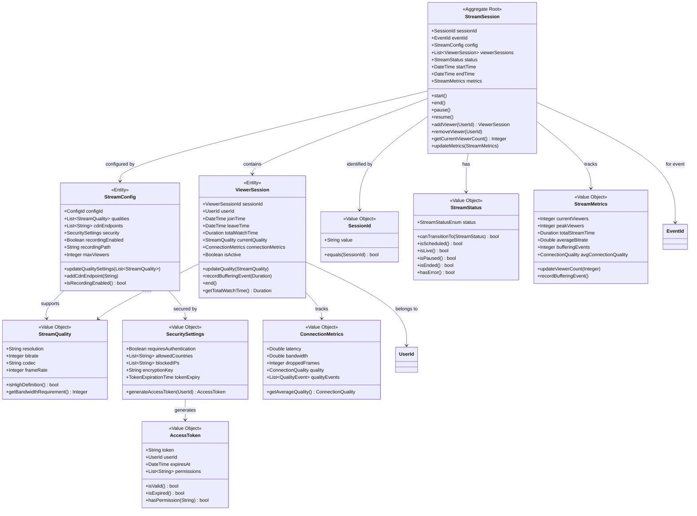
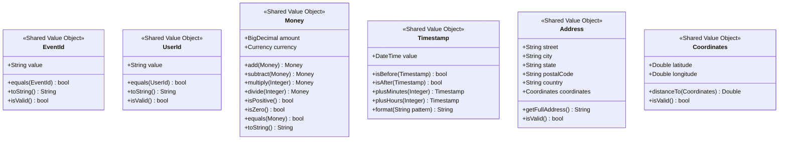
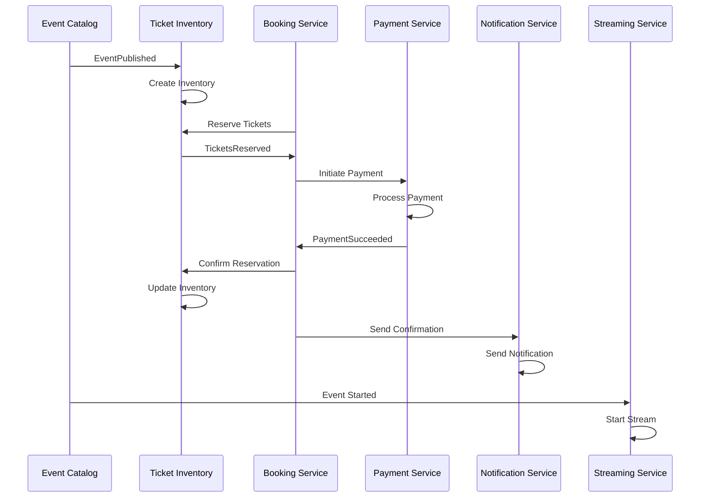

# Domain-Driven Design - Domain Models Diagrams

## Plateforme de Réservation d'Événements en Ligne

## 1. Event Catalog Service Domain Model

**Domain Events:**

- EventCreated
- EventPublished
- EventUpdated
- EventCancelled

---

## 2. Ticket Inventory Service Domain Model

**Domain Events:**

- InventoryCreated
- TicketsReserved
- TicketsReleased
- InventoryUpdated
- InventorySoldOut

---

## 3. Booking Service Domain Model

**Domain Events:**

- ReservationCreated
- ReservationConfirmed
- ReservationCancelled
- ReservationExpired
- ReservationItemAdded

---

## 4. Payment Service Domain Model

**Domain Events:**

- PaymentInitiated
- PaymentSucceeded
- PaymentFailed
- RefundProcessed
- RefundFailed

---

## 5. User Management Service Domain Model

**Domain Events:**

- UserRegistered
- UserAuthenticated
- ProfileUpdated
- UserDeactivated
- PasswordChanged

---

## 6. Notification Service Domain Model

**Domain Events:**

- NotificationSent
- DeliveryConfirmed
- DeliveryFailed
- CampaignCompleted

---

## 7. Streaming Service Domain Model

**Domain Events:**

- StreamStarted
- StreamEnded
- ViewerJoined
- ViewerLeft
- StreamQualityChanged
- StreamingError

---

## Shared Kernel - Common Domain Objects

## Integration Events Mapping

## Domain Services and Factories

### Domain Services Needed:

1. **ReservationOrchestratorService** - Coordinates reservation process
2. **InventoryAvailabilityService** - Checks ticket availability across events
3. **PaymentProcessorService** - Handles external payment gateway integration
4. **StreamingOrchestratorService** - Manages streaming lifecycle
5. **NotificationDispatcherService** - Routes notifications to appropriate channels

### Factories:

1. **EventFactory** - Creates events with proper validation
2. **ReservationFactory** - Creates reservations with business rules
3. **PaymentFactory** - Creates payments with proper method validation
4. **StreamSessionFactory** - Creates streaming sessions with configuration
5. **NotificationCampaignFactory** - Creates notification campaigns with templates

