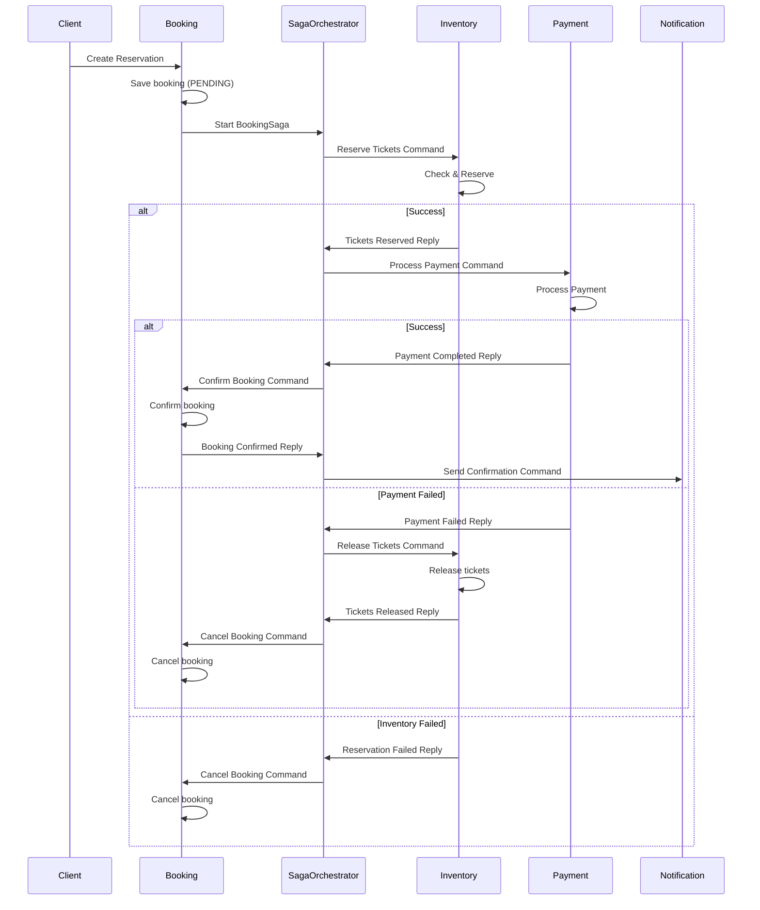

---
aliases:
---

```mermaid
sequenceDiagram
    participant Client
    participant Booking
    participant SagaOrchestrator
    participant Inventory
    participant Payment
    participant Notification
    
    Client->>Booking: Create Reservation
    Booking->>Booking: Save booking (PENDING)
    Booking->>SagaOrchestrator: Start BookingSaga
    
    SagaOrchestrator->>Inventory: Reserve Tickets Command
    Inventory->>Inventory: Check & Reserve
    alt Success
        Inventory->>SagaOrchestrator: Tickets Reserved Reply
        SagaOrchestrator->>Payment: Process Payment Command
        Payment->>Payment: Process Payment
        alt Success
            Payment->>SagaOrchestrator: Payment Completed Reply
            SagaOrchestrator->>Booking: Confirm Booking Command
            Booking->>Booking: Confirm booking
            Booking->>SagaOrchestrator: Booking Confirmed Reply
            SagaOrchestrator->>Notification: Send Confirmation Command
        else Payment Failed
            Payment->>SagaOrchestrator: Payment Failed Reply
            SagaOrchestrator->>Inventory: Release Tickets Command
            Inventory->>Inventory: Release tickets
            Inventory->>SagaOrchestrator: Tickets Released Reply
            SagaOrchestrator->>Booking: Cancel Booking Command
            Booking->>Booking: Cancel booking
        end
    else Inventory Failed
        Inventory->>SagaOrchestrator: Reservation Failed Reply
        SagaOrchestrator->>Booking: Cancel Booking Command
        Booking->>Booking: Cancel booking
    end
```