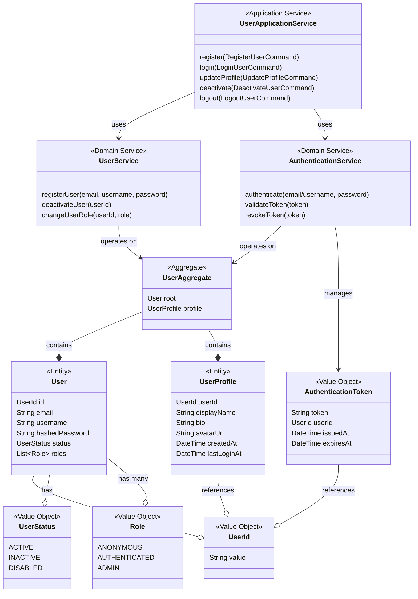
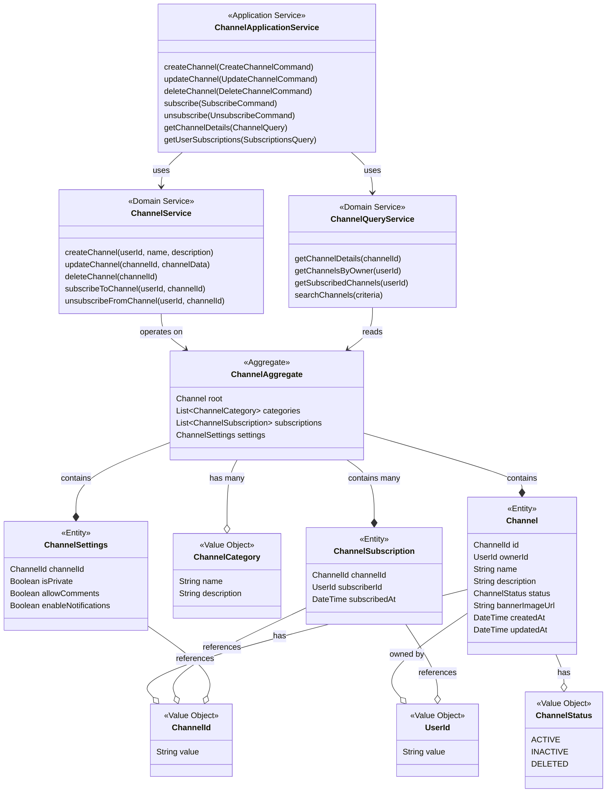
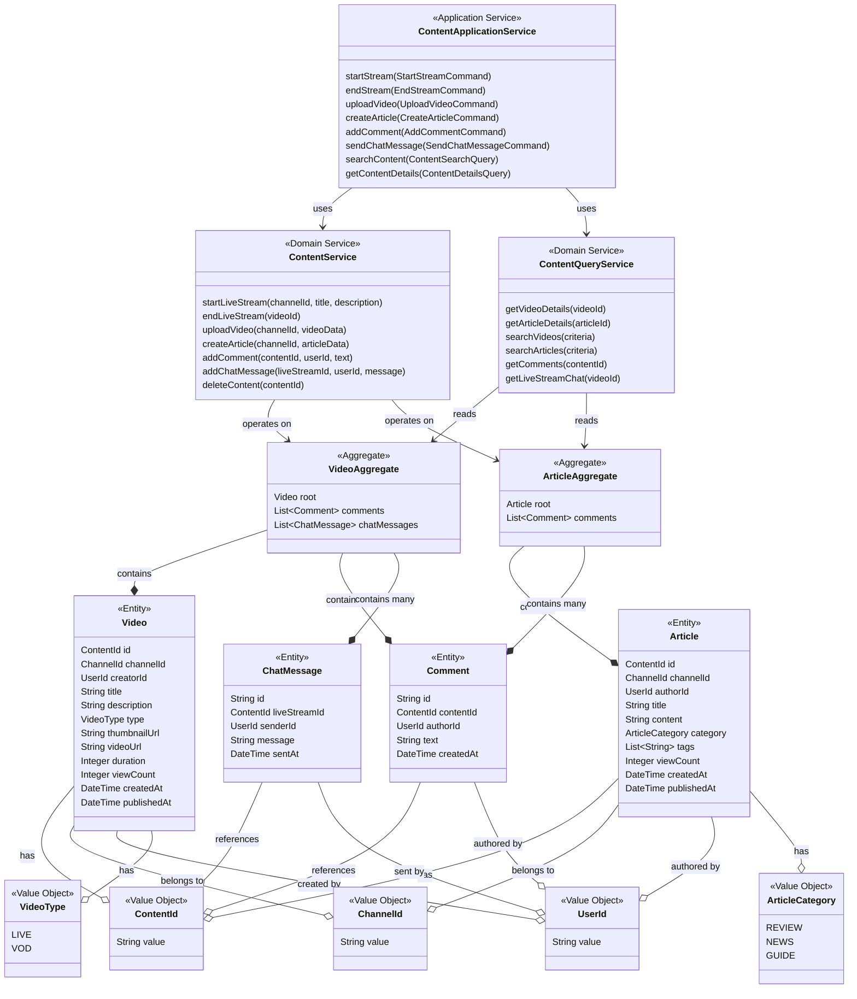
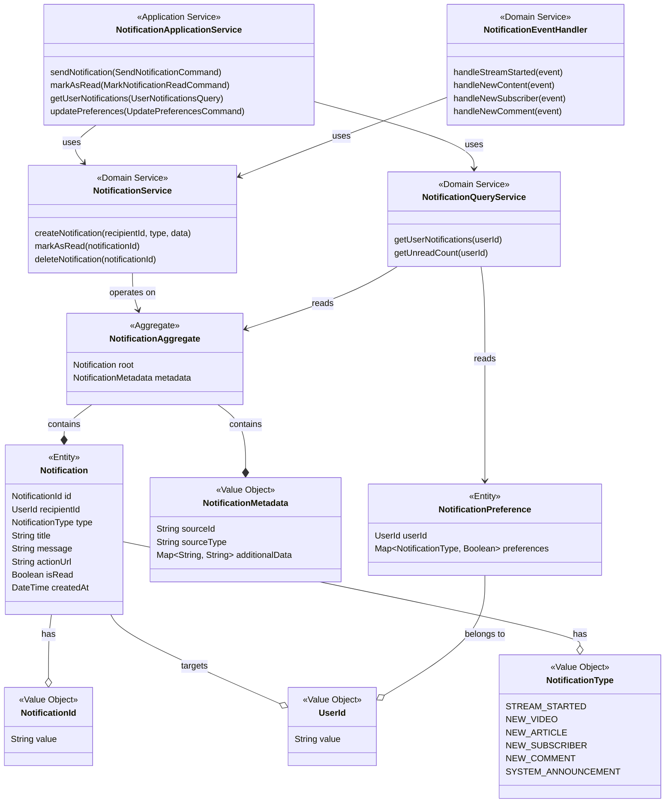
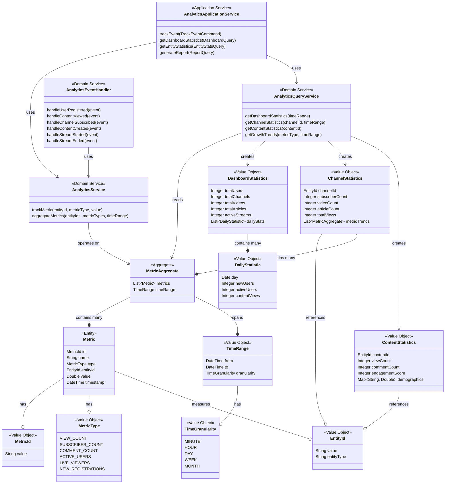

### 1. Identity & Access Management Context
Provides user identity and authentication to all other contexts

### 2. Channel Management Context
Organizes content and manages subscriptions

### 3. Content Management Context
Handles videos, articles, comments and chat messages

### 4. Notification Context
Responds to events from other contexts to create notifications

### 5. Analytics Context
Tracks metrics across all contexts for reporting
