```mermaid
flowchart TB
    subgraph "Client Layer"
        UI[Web UI]
        Mobile[Mobile App - Bonus]
    end

    subgraph "API Gateway"
        Gateway[Spring Cloud Gateway]
        WAF[AWS WAF / ModSecurity]
    end

    subgraph "Identity & Access"
        Keycloak[Keycloak IAM]
        KeycloakDB[(PostgreSQL for Keycloak)]
    end

    subgraph "Service Mesh - Istio"
        subgraph "Core Services"
            UserService[User Service]
            ChannelService[Channel Service]
            StreamService[Stream Service]
            VideoService[Video & VOD Service]
            SearchService[Search Service]
            EventService[Event Service]
            BlogService[Blog Service]
        end
        
        subgraph "Supporting Services"
            NotificationService[Notification Service]
            AnalyticsService[Analytics Service]
        end
        
        subgraph "Observability"
            Prometheus[Prometheus]
            Grafana[Grafana]
            Jaeger[Jaeger]
            ELK[ELK Stack]
        end
    end

    subgraph "External Services"
        subgraph "AWS Media Services"
            MediaLive[AWS MediaLive - Ingest & Process Live]
            MediaConvert[AWS MediaConvert - Process VOD]
            S3[Amazon S3 - Store]
            CloudFront[Amazon CloudFront - Deliver]
        end
        
        subgraph "Notification Infrastructure"
            SNS[AWS SNS]
            WebSocketAPI[WebSocket API Service]
            FCM[Firebase Cloud Messaging]
        end
    end

    subgraph "Data Layer"
        PostgreSQL[(PostgreSQL)]
        MongoDB[(MongoDB)]
        Redis[(Redis)]
        RabbitMQ[RabbitMQ]
        Vault[HashiCorp Vault]
    end

    UI --> Gateway
    Mobile --> Gateway
    
    Gateway --> WAF
    WAF --> Keycloak
    WAF --> UserService
    WAF --> ChannelService
    WAF --> StreamService
    WAF --> VideoService
    WAF --> SearchService
    WAF --> EventService
    WAF --> BlogService
    WAF --> NotificationService
    
    Keycloak --> KeycloakDB
    
    UserService <--> PostgreSQL
    UserService <--> Keycloak
    UserService <--> ChannelService
    UserService <--> NotificationService
    
    ChannelService <--> PostgreSQL
    ChannelService <--> StreamService
    ChannelService <--> VideoService
    ChannelService <--> AnalyticsService
    
    StreamService <--> MongoDB
    StreamService <--> MediaLive
    StreamService <--> Redis
    StreamService <--> NotificationService
    StreamService <--> RabbitMQ
    
    VideoService <--> MongoDB
    VideoService <--> S3
    VideoService <--> MediaConvert
    VideoService <--> CloudFront
    VideoService <--> NotificationService
    
    SearchService <--> MongoDB
    SearchService <--> PostgreSQL
    SearchService <--> Redis
    
    EventService <--> PostgreSQL
    EventService <--> NotificationService
    
    BlogService <--> PostgreSQL
    BlogService <--> SearchService
    
    NotificationService <--> Redis
    NotificationService <--> RabbitMQ
    NotificationService <--> SNS
    NotificationService <--> WebSocketAPI
    NotificationService <--> FCM
    
    AnalyticsService <--> MongoDB
    AnalyticsService <--> PostgreSQL
    
    %% All services connect to Vault for secrets
    UserService <--> Vault
    ChannelService <--> Vault
    StreamService <--> Vault
    VideoService <--> Vault
    SearchService <--> Vault
    EventService <--> Vault
    BlogService <--> Vault
    NotificationService <--> Vault
    AnalyticsService <--> Vault
    
    %% Observability connections
    UserService <--> Prometheus
    ChannelService <--> Prometheus
    StreamService <--> Prometheus
    VideoService <--> Prometheus
    SearchService <--> Prometheus
    EventService <--> Prometheus
    BlogService <--> Prometheus
    NotificationService <--> Prometheus
    AnalyticsService <--> Prometheus
    
    Prometheus --> Grafana
    
    UserService <--> Jaeger
    ChannelService <--> Jaeger
    StreamService <--> Jaeger
    VideoService <--> Jaeger
    SearchService <--> Jaeger
    EventService <--> Jaeger
    BlogService <--> Jaeger
    NotificationService <--> Jaeger
    AnalyticsService <--> Jaeger
    
    UserService <--> ELK
    ChannelService <--> ELK
    StreamService <--> ELK
    VideoService <--> ELK
    SearchService <--> ELK
    EventService <--> ELK
    BlogService <--> ELK
    NotificationService <--> ELK
    AnalyticsService <--> ELK

```

# Comprehensive Service Details: Final Streaming Platform Architecture

## 1. Service Mesh Implementation (Istio)

Istio service mesh has been integrated into the architecture to provide:

- **mTLS**: Automatic encryption of service-to-service communication
- **Traffic Management**: Advanced routing, load balancing, and traffic splitting
- **Observability**: Enhanced metrics, logs, and traces collection
- **Policy Enforcement**: Security policies enforced across all services
- **Service Discovery**: Automatic service discovery and load balancing

Istio runs as a sidecar proxy (Envoy) alongside each service, handling all network communication and providing a consistent security layer.

## 2. Notification System

For notifications, a hybrid approach using multiple technologies is implemented:

- **AWS SNS**: For reliable, scalable push notification delivery
- **WebSocket API Service**: For real-time notifications to web clients
- **Firebase Cloud Messaging (FCM)**: For push notifications to mobile devices
- **RabbitMQ**: For internal event distribution between services
- **Redis**: For managing notification state and temporary storage

This multi-tier approach provides flexibility for different notification types and ensures reliable delivery across various platforms.

## 3. Detailed Service Descriptions

### API Gateway (Spring Cloud Gateway)

- **Responsibilities**: Route requests, authenticate users, rate limiting, request validation
- **Security Features**: Integration with WAF, JWT validation, TLS termination
- **Interactions**: Communicates with Keycloak for token validation, routes to appropriate microservices
- **Technical Stack**: Spring Cloud Gateway, Spring Security

### WAF (AWS WAF or ModSecurity)

- **Responsibilities**: Block malicious traffic, prevent common attacks
- **Security Features**: OWASP Top 10 protection, rate limiting, IP blocking
- **Interactions**: Sits in front of API Gateway, inspects all incoming traffic
- **Technical Stack**: AWS WAF or ModSecurity with NGINX

### Keycloak

- **Responsibilities**: Authentication, authorization, user management, SSO
- **Security Features**: MFA, social login, password policies, session management
- **Interactions**: Provides tokens to services, validates user credentials
- **Technical Stack**: Keycloak, PostgreSQL database
- **Data**: User accounts, roles, permissions, client configurations

### User Service

- **Responsibilities**: User profile management, preferences, subscription relationships
- **Security Features**: Input validation, secure password handling, rate limiting
- **Interactions**:
    - Consumes authentication from Keycloak
    - Provides user data to Channel, Stream, and other services
    - Sends events to Notification Service for user-related notifications
- **Technical Stack**: Spring Boot, Spring Security, Spring Data JPA
- **Data**: User profiles, preferences, settings (in PostgreSQL)

### Channel Service

- **Responsibilities**: Channel creation, configuration, analytics, subscriptions
- **Security Features**: Access control, content validation
- **Interactions**:
    - Uses User Service to validate channel ownership
    - Communicates with Stream Service for live status
    - Works with Video Service for VOD content
    - Sends channel events to Notification Service
    - Provides data to Analytics Service
- **Technical Stack**: Spring Boot, Spring Data JPA
- **Data**: Channel metadata, configurations, subscription relationships (in PostgreSQL)

### Stream Service

- **Responsibilities**: Live stream management, stream chat, integration with AWS MediaLive
- **Security Features**: Stream key security, chat moderation, rate limiting
- **Interactions**:
    - Coordinates with AWS MediaLive for stream ingestion
    - Uses Channel Service for channel validation
    - Publishes events to Notification Service
    - Utilizes Redis for real-time chat and viewer counts
    - Records streams for later VOD conversion via Video Service
- **Technical Stack**: Spring Boot, WebSocket, AWS SDK, MongoDB for metadata
- **Data**: Stream metadata, chat data, viewer metrics (MongoDB), real-time data (Redis)

### Video Service

- **Responsibilities**: VOD management, comments, AWS S3 and MediaConvert integration
- **Security Features**: Secure content storage, signed URLs, content validation
- **Interactions**:
    - Uses S3 for video storage
    - Coordinates with MediaConvert for transcoding
    - Utilizes CloudFront for content delivery
    - Interfaces with Channel Service for content ownership
    - Publishes events to Notification Service
- **Technical Stack**: Spring Boot, AWS SDK, MongoDB
- **Data**: Video metadata, processing status, comments (MongoDB)

### Search Service

- **Responsibilities**: Unified search across all content types, content discovery
- **Security Features**: Query sanitization, rate limiting
- **Interactions**:
    - Consumes data from all services for indexing
    - Provides search results to API Gateway
    - Uses Redis for caching frequent searches
- **Technical Stack**: Spring Boot, Elasticsearch or MongoDB full-text search
- **Data**: Search indexes (in MongoDB/Elasticsearch), search cache (Redis)

### Event Service

- **Responsibilities**: Tournament creation, registration, schedule management
- **Security Features**: Input validation, access control
- **Interactions**:
    - Uses User Service for participant validation
    - Publishes event updates to Notification Service
    - Coordinates with Channel Service for tournament streams
- **Technical Stack**: Spring Boot, Spring Data JPA
- **Data**: Event details, registrations, results (PostgreSQL)

### Blog Service

- **Responsibilities**: Gaming news and reviews creation, management, comments
- **Security Features**: Content moderation, XSS prevention
- **Interactions**:
    - Uses User Service for author verification
    - Provides content to Search Service for indexing
    - Coordinates with Channel Service for blog ownership
- **Technical Stack**: Spring Boot, Spring Data JPA
- **Data**: Blog posts, categories, tags, comments (PostgreSQL)

### Notification Service

- **Responsibilities**: Real-time notifications, message delivery, subscription alerts
- **Security Features**: Notification permission validation, rate limiting
- **Interactions**:
    - Consumes events from all services via RabbitMQ
    - Uses AWS SNS for push notifications
    - Uses WebSocket API for real-time web notifications
    - Uses FCM for mobile push notifications
    - Stores notification state in Redis
- **Technical Stack**: Spring Boot, WebSocket, AWS SDK, Firebase Admin SDK
- **Data**: Notification templates, delivery status, user preferences (Redis & PostgreSQL)

### Analytics Service

- **Responsibilities**: Platform metrics, user engagement analytics, dashboard data
- **Security Features**: Data anonymization, access control
- **Interactions**:
    - Collects data from all services
    - Provides aggregated metrics for admin dashboard
- **Technical Stack**: Spring Boot, time-series database
- **Data**: Metrics, aggregations, statistics (MongoDB & PostgreSQL)

### Observability Components

#### Prometheus & Grafana

- **Responsibilities**: Metrics collection, visualization, alerting
- **Interactions**: Collects metrics from all services, displays dashboards
- **Security Features**: Access control, TLS encryption

#### Jaeger

- **Responsibilities**: Distributed tracing, request flow visualization
- **Interactions**: Collects trace data from all services
- **Security Features**: Data sampling, access control

#### ELK Stack

- **Responsibilities**: Log aggregation, analysis, searching
- **Interactions**: Collects logs from all services and infrastructure
- **Security Features**: Log redaction, access control

### Data Layer Components

#### PostgreSQL

- **Usage**: Structured data for User, Channel, Event, Blog services
- **Security Features**: TLS, encryption at rest, access control

#### MongoDB

- **Usage**: Semi-structured data for Stream, Video, Analytics services
- **Security Features**: TLS, encryption at rest, access control

#### Redis

- **Usage**: Caching, real-time features, temporary storage
- **Security Features**: Authentication, encryption in transit

#### RabbitMQ

- **Usage**: Event distribution, asynchronous communication
- **Security Features**: TLS, authentication, vhost isolation

#### HashiCorp Vault

- **Usage**: Secrets management, credentials storage
- **Security Features**: Encryption, access control, audit logging

## 4. Service Interaction Flows

### Live Streaming Flow

1. User initiates stream via Channel Service
2. Channel Service validates permissions with User Service
3. Stream Service creates stream configuration in AWS MediaLive
4. User's client connects to MediaLive using secure stream key
5. MediaLive processes stream and delivers to viewers via CloudFront
6. Stream Service publishes event to Notification Service
7. Notification Service alerts subscribers via WebSocket/SNS/FCM
8. Chat messages flow through Stream Service using WebSockets and Redis
9. Analytics Service collects viewership metrics

### VOD Flow

1. Stream Service signals stream end to Video Service
2. Video Service initiates MediaConvert job to process the recording
3. Processed video is stored in S3 and metadata in MongoDB
4. CloudFront serves video content to users
5. Notification Service alerts subscribers about new video
6. Search Service indexes the new video content

### Event Registration Flow

1. Admin creates tournament via Event Service
2. Event Service publishes notification event
3. Users register through Event Service
4. Event Service validates users via User Service
5. Event Service creates schedule and notifies participants via Notification Service
6. During event, Stream Service coordinates with Channel Service for broadcasts

## 5. Security Features Across the Architecture

- **All services**:
    
    - Implemented behind Istio service mesh with mTLS
    - Integrated with Keycloak for authentication/authorization
    - Connected to HashiCorp Vault for secrets
    - Protected by WAF at API Gateway layer
    - Secured with proper network policies in Kubernetes
    - Monitored by comprehensive observability stack
- **API Layer**:
    
    - Rate limiting to prevent DDoS
    - Input validation to prevent injection attacks
    - JWT validation for all authenticated endpoints
- **Data Layer**:
    
    - Encryption at rest for all databases
    - TLS for all connections
    - Proper access controls and least privilege
- **Media Content**:
    
    - Signed URLs for content access
    - Content scanning for prohibited material
    - Secure stream keys with rotation policy

This final architecture creates a comprehensive, secure, and observable streaming platform that addresses all your project requirements while incorporating the security measures outlined in your document.